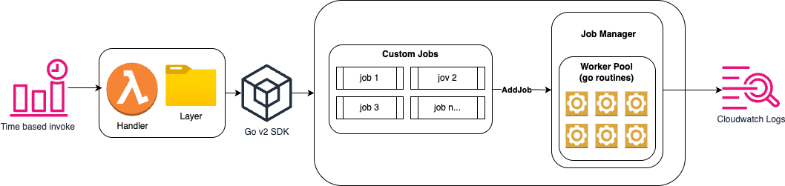

# Rate Limit & Resource Quota Monitoring Solution

## Solution(s) Overview

This repository contains two complementary, serverless Go projects following AWS best practices for EMF-based metrics:

---
#### ⚠️ Disclaimer ⚠️
This repository is provided as a functional example. It is not intended to represent a production-ready "drop in" solution. Before using in any live environment, you should:

- Review and adjust IAM permissions to follow the principle of least privilege
- Review encryption at rest and in transit for all resources (SQS, Lambda, logs, etc.)
- Configure VPC, subnet, and security group settings according to your network requirements
- Implement proper monitoring, alerting, and log retention lifecycles
- Be aware of any costs associated with deploying in your account(s)

Use this sample as a starting point, not a drop-in solution. Customize this solution based on your organization’s security, reliability, and operational requirements.

---

1. **Rate Limit Monitor**
An **event-driven** pipeline that captures control-plane API call rates and publishes RequestPerSecond metric to Cloudwatch in ~60s intervals
  

2. **Resource Quota Utilization** 
  A scheduled lambda function that computes resource utilization across your account by making various describe calls, retrieving the current quota from Service Quotas and publishing a utilization metric (%) in Cloudwatch. 

    This project is aimed to capture utilization metrics for resources that do not have coverage natively. 

    As of now we have support for the following metrics, with plans to continuously add more based on customer feedback: 
  
    - total networker interface per region
    - VPC Nau (Network Address Units)
    - total g3Storage 
    - total oidc providers
    - total EKS Clusters
    - total iam roles

---
## Repo Folder Structure

```bash
cmd / # entry point location for each project
    emf-extension/      # lambda extension   
            main.go 
    ratelimit/          # rate limit solution
            main.go 
    resourcequota/      # resource quota solution
            main.go 
infra /                 # folder for deploying via cloudformation and terraform 
        /cloudormation 
                /ratelimit
                        template.yaml
                /resourcequota
                        template.yaml
        /terraform 
                /ratelimit
                        main.tf
                        variables.tf
                /resourcequota
                        main.tf
                        variables.tf
internal/   # folder for internal libraries useds
lambda-layer/ # directory for lambda layer
```

## Architecture Diagrams


### Rate Limit Monitor 


--------

### Resource Quota Utilization 



---


## Subproject READMEs
Please navigate to each projects README file for more details.

- [Rate Limit Solution → `cmd/ratelimit/README.md`](cmd/ratelimit/README.md) 
  
- [Resource Quota Utilization → `cmd/resourcequota/README.md`](cmd/resourcequota/README.md)
