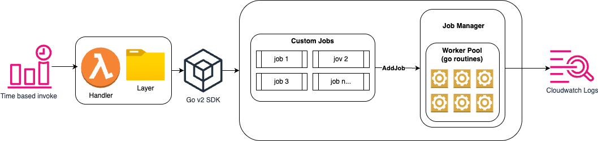

# Rate Limit & Resource Quota Monitoring Solution


## Solution Overview


This repository contains two complementary, serverless Go projects following AWS best practices for EMF-based metrics:


1. **Rate Limit Monitor** 
  An **event-driven** pipeline that captures control-plane API call rates and publishes CallCount metric to Cloudwatch in real-time.
  
    Pattern: EventBridge → SQS FIFO (single queue, per-rule message groups) → Lambda (batch of 10) → EMF in CloudWatch Logs.


2. **Resource Quota Utilization** 
  A scheduled lambda function that computes resource utilization across your account by making various describe calls, retrieving the current quota from Service Quotas and publishing a utilization metric (%) in Cloudwatch. 

    This project is aimed to capture utilization metrics for resources that do not have coverage natively. 

    As of now we have support for the following metrics, with plans to continuously add more based on customer feedback: 
  
    - total networker interface per region
    - VPC Nau (network address units)
    - total g3Storage 
    - total oidc providers
    - total EKS Clusters
    - total iam roles
   


---
## Repo Folder Structure
```bash
cmd / ## entry point location for each project
    ratelimit/
            main.go ## entry point for rate limit solution
    resourcequota/
            main.go ## entry point for resource quota solution
infra / ## folder for cloudformation templates to deploy solution 
      ratelimit/
              template.yaml # cloudformation template for rate limit solution
      resourcequota
              template.yaml # cloudformation template for resource quota solution 
internal/   # folder for internal libraries useds
lambda-layer/ # directory where lambda layer is stored

```

## Architecture Diagrams


### Rate Limit Monitor 


### Resource Quota Utilization 



---


## Subproject READMEs


- [Rate Limit Monitor → `cmd/ratelimit/README.md`](cmd/ratelimit/README.md) 
- [Resource Quota Meter → `cmd/resourcequota/README.md`](cmd/resourcequota/README.md)


---


## AWS Services & IAM


Both solutions emit EMF documents via CloudWatch Logs; each Lambda needs basic CW Logs permissions plus service-specific API calls.


### Rate Limit Solution IAM requirements


```yaml
# Allows reading from SQS FIFO and writing EMF to CloudWatch Logs
Statement:
 - Effect: Allow
   Action:
     # SQS
     - sqs:ReceiveMessage
     - sqs:DeleteMessage
     - sqs:GetQueueAttributes
     # CloudWatch Logs
     - logs:CreateLogGroup
     - logs:DescribeLogGroups
     - logs:CreateLogStream
     - logs:DescribeLogStreams
     - logs:PutLogEvents
   Resource: "*"
```
### Resource Quota Solution IAM requirements
```yaml
# Allows Describe/List on AWS services, plus writing EMF to CloudWatch Logs
Statement:
 - Effect: Allow
   Action:
     # EC2
     - ec2:DescribeNetworkInterfaces
     - ec2:DescribeNatGateways
     - ec2:DescribeVpcEndpoints
     - ec2:DescribeSubnets
     - ec2:DescribeTransitGatewayVpcAttachments
     - ec2:DescribeVpcs


     # EKS
     - eks:ListClusters


     # IAM
     - iam:ListOpenIDConnectProviders
     - iam:ListRoles


     # Support (Trusted Advisor)
     - support:RefreshTrustedAdvisorCheck


     # ELBv2
     - elasticloadbalancing:DescribeLoadBalancers


     # EFS
     - elasticfilesystem:DescribeFileSystems
     - elasticfilesystem:DescribeMountTargets


     # Service Quotas
     - servicequotas:GetServiceQuota


     # CloudWatch Logs for EMF publishing
     - logs:CreateLogGroup
     - logs:DescribeLogGroups
     - logs:CreateLogStream
     - logs:DescribeLogStreams
     - logs:PutLogEvents
   Resource: "*"
```
