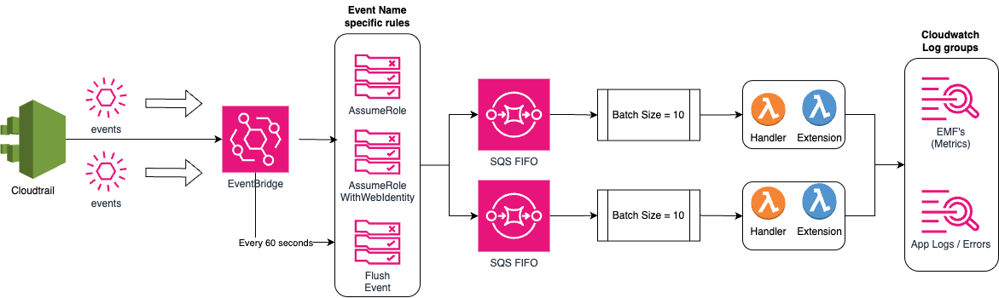

# Rate Limit Monitoring Solution

1. [Overview](#overview)
2. [Deployment Guide](#deployment-guide)
    - [Environment Variables](#environment-variables)
    - [Deploying w/ AWS SAM / Cloudformation](#deploying-with-aws-sam--cloudformation)
    - [Deploying w/ Terraform](#deploying-with-terraform)

## Overview

The Rate Limit Monitoring solution:
- captures control-plane API calls from CloudTrail via EventBridge
- routes them through event specifc SQS FIFO queues 
- lambda receives the event and generates an EMF for each event
- event bridge will send a flush event every 60s that will tell lambda to publish all EMF's in the buffer
- the lambda extension listens for SHUTDOWN lifecycle event and will flush any remaining EMF's in the buffer prior to lambda container being destroyed



## Deployment Guide

---

#### ⚠️ Disclaimer ⚠️
This repository is provided as a functional example to demonstrate how you might capture control-plane events, buffer them through SQS, and emit EMF metrics via Lambda. It is not intended to represent a production-ready "drop in" solution. Before using in any live environment, you should:

- Review and adjust IAM permissions to follow the principle of least privilege
- Review encryption at rest and in transit for all resources (SQS, Lambda, logs, etc.)
- Configure VPC, subnet, and security group settings according to your network requirements
- Implement proper monitoring, alerting, and log retention lifecycles
- Be aware of any costs associated with deploying in your account(s)

Use this sample as a starting point, not a drop-in solution. Customize this solution based on your organization’s security, reliability, and operational requirements.

---

This project can be deployed via [CloudFormation / AWS SAM](#deploying-with-cloudformation--aws-sam) or [Terraform](#deploying-with-terraform).  

When deploying with AWS SAM:
- build / package emf extension
- send zip file containing artifact to s3
- deploy sam template

When deploying with Terraform:
- build / package emf extension 
- send zip file containing artifact to s3
- build / package lambda function 
- create / apply terraform plan

### Prerequisites

**Tools**

| Tool         | Version      | Install                                                                                          |
|--------------|--------------|--------------------------------------------------------------------------------------------------|
| Go           | ≥1.23.0      | https://golang.org/dl/                                                                           |
| Terraform    | ≥1.0.0       | https://learn.hashicorp.com/tutorials/terraform/install-cli                                      |
| AWS SAM CLI  | ≥1.142.1     | https://docs.aws.amazon.com/serverless-application-model/latest/developerguide/install-sam-cli.html |
| AWS CLI      | Latest       | https://docs.aws.amazon.com/cli/latest/userguide/getting-started-install.html                    |


### Environment Variables

This Lambda uses the following environment variables:

| Name               | Description                                                                                     | Default                    | Valid Choices                   | Type             |
|--------------------|-------------------------------------------------------------------------------------------------|----------------------------|---------------------------------|------------------|
| REGIONS            | Comma-separated list of AWS regions to run solution against (e.g. `us-east-1,us-west-2`)        | `us-east-1`                | —                               | list(string)     |
| LOG_LEVEL          | Log verbosity                                                                                   | `info`                     | `debug`, `info`, `warn`, `error`| string           |
| LOG_GROUP_NAME     | CloudWatch Logs group name for EMF output                                                       | `/lambda/ratelimit/emf`    | —                               | string           |
| METRIC_NAMESPACE   | CloudWatch Metric Namespace                                                                     | `Rate Limit`               | —                               | string           |
| PROPAGATE_INVOKER  | Emit per-invoker metrics                                                                      | `false`                    | `true`, `false`                 | boolean          |


---

### Deploying with AWS SAM / Cloudformation 

Prior to deploying, please review the resource below to see what AWS SAM / Cloudformation will deploy.  

#### ⚠️ Warning ⚠️
Please make changes to the template based on your specific environment / security requirements.  This is a functional sample but is not verified to be production ready by default

#### Resources

| Logical ID                             | Type                             | Description                                                       | Key Properties                                                                                                                                                                                  |
|----------------------------------------|----------------------------------|-------------------------------------------------------------------|-------------------------------------------------------------------------------------------------------------------------------------------------------------------------------------------------|
| **AssumeRoleQueue**                    | AWS::SQS::Queue                  | FIFO queue to buffer AssumeRole events                            | QueueName: assume-role-queue.fifo<br>FifoQueue: true<br>ContentBasedDeduplication: true<br>VisibilityTimeout: 30                                                                                 |
| **AssumeRoleWebIdentityQueue**         | AWS::SQS::Queue                  | FIFO queue to buffer AssumeRoleWithWebIdentity events             | QueueName: assume-role-web-identity-queue.fifo<br>FifoQueue: true<br>ContentBasedDeduplication: true<br>VisibilityTimeout: 30                                                                  |
| **KeepAliveToAssumeRoleRule**          | AWS::Events::Rule                | 1-min scheduled “flush” ping to the AssumeRole SQS queue          | ScheduleExpression: rate(1 minute)<br>Targets: SQS → AssumeRoleQueue via EventBridgeDeliveryRole, InputTemplate: `{"flush":true}`<br>MessageGroupId: flush-group                               |
| **KeepAliveToWebIdentityRule**         | AWS::Events::Rule                | 1-min scheduled “flush” ping to the WebIdentity SQS queue         | ScheduleExpression: rate(1 minute)<br>Targets: SQS → AssumeRoleWebIdentityQueue via EventBridgeDeliveryRole, InputTemplate: `{"flush":true}`<br>MessageGroupId: flush-group                       |
| **AssumeRoleRule**                     | AWS::Events::Rule                | Routes CloudTrail AssumeRole API calls to the FIFO queue         | EventPattern: detail-type = "AWS API Call via CloudTrail", eventName = ["AssumeRole"], awsRegion = !Split[",", !Ref Regions]<br>Target: AssumeRoleQueue (MessageGroupId: assume-role-group)      |
| **AssumeRoleWithWebIdentityRule**      | AWS::Events::Rule                | Routes CloudTrail AssumeRoleWithWebIdentity API calls to queue    | EventPattern: detail-type = "AWS API Call via CloudTrail", eventName = ["AssumeRoleWithWebIdentity"], awsRegion = !Split[",", !Ref Regions]<br>Target: WebIdentityQueue (MessageGroupId)       |
| **AssumeRoleQueuePolicy**              | AWS::SQS::QueuePolicy            | Grants EventBridge permission to send to AssumeRoleQueue          | Queues: [!Ref AssumeRoleQueue]<br>Action: sqs:SendMessage, sqs:SendMessageBatch<br>Principal: events.amazonaws.com                                                                                |
| **AssumeRoleWebIdentityQueuePolicy**   | AWS::SQS::QueuePolicy            | Grants EventBridge permission to send to WebIdentityQueue         | Queues: [!Ref AssumeRoleWebIdentityQueue]<br>Action: sqs:SendMessage, sqs:SendMessageBatch<br>Principal: events.amazonaws.com                                                                       |
| **LambdaExecutionRole**                | AWS::IAM::Role                   | IAM role assumed by both Lambdas                                   | AssumeRolePolicy: lambda.amazonaws.com<br>ManagedPolicyArns: AWSLambdaBasicExecutionRole, AWSLambdaSQSQueueExecutionRole<br>Inline policy: logs:DescribeLogGroups/Streams                     |
| **EventBridgeDeliveryRole**            | AWS::IAM::Role                   | IAM role allowing EventBridge to post to both SQS queues          | AssumeRolePolicy: events.amazonaws.com<br>Inline policy: sqs:SendMessage, sqs:SendMessageBatch on both queues                                                                                  |
| **RateLimitExtensionLayer**            | AWS::Lambda::LayerVersion        | EMF extension to flush any remaining metrics on shutdown          | Content: S3Bucket = !Ref ExtensionBucket, S3Key = emf/emf-extension.zip<br>CompatibleRuntimes: provided.al2023<br>CompatibleArchitectures: arm64                                                |
| **AssumeRoleFunction**                 | AWS::Serverless::Function        | Processes AssumeRoleQueue messages → emits EMF metrics             | CodeUri: ../../../cmd/ratelimit<br>Handler: !Ref AssumeRoleHandler<br>Runtime: provided.al2023<br>Layers: [RateLimitExtensionLayer]<br>Environment vars + SQS trigger, batchSize=10           |
| **AssumeRoleWithWebIdentityFunction**  | AWS::Serverless::Function        | Processes WebIdentityQueue messages → emits EMF metrics            | CodeUri: ../../../cmd/ratelimit<br>Handler: !Ref AssumeWebIdentityHandler<br>Runtime: provided.al2023<br>Layers: [RateLimitExtensionLayer]<br>Environment vars + SQS trigger, batchSize=10    |
| **AssumeRoleRPSAlarm**                 | AWS::CloudWatch::Alarm           | Alarm when AssumeRole RPS exceeds threshold                       | Metrics: CallCount Sum (Period=60)<br>Threshold: 100<br>Expression: CallCount/60<br>ComparisonOperator: ≥Threshold<br>EvaluationPeriods:1                                                       |
| **AssumeRoleWithWebIdentityRPSAlarm**  | AWS::CloudWatch::Alarm           | Alarm when WebIdentity RPS exceeds threshold                      | Metrics: CallCount Sum (Period=60)<br>Threshold: 100<br>Expression: CallCount/60<br>ComparisonOperator: ≥Threshold<br>EvaluationPeriods:1                                                       |
| **AssumeRoleErrorFilter**              | AWS::Logs::MetricFilter          | Captures any `ERROR` logs from AssumeRole Lambda                  | FilterPattern: `"ERROR"`<br>LogGroupName: /aws/lambda/${AssumeRoleFunction}<br>Transforms → MetricName: Error Count, Value: "1"                                                               |
| **AssumeRoleWithWebIdentityErrorFilter** | AWS::Logs::MetricFilter        | Captures any `ERROR` logs from WebIdentity Lambda                 | FilterPattern: `"ERROR"`<br>LogGroupName: /aws/lambda/${AssumeRoleWithWebIdentityFunction}<br>Transforms → MetricName: Error Count, Value: "1"                                                |
| **AssumeRoleErrorAlarm**               | AWS::CloudWatch::Alarm           | Alarm on any `ERROR` logs emitted by AssumeRole Lambda            | Namespace: !Ref MetricNamespace<br>MetricName: Error Count<br>Dimensions: LogGroupName = /aws/lambda/${AssumeRoleFunction}<br>Statistic: Sum, Threshold:1, Period:60, EvalPeriods:1         |
| **AssumeRoleWithWebIdentityErrorAlarm**| AWS::CloudWatch::Alarm           | Alarm on any `ERROR` logs emitted by WebIdentity Lambda           | Namespace: !Ref MetricNamespace<br>MetricName: Error Count<br>Dimensions: LogGroupName = /aws/lambda/${AssumeRoleWithWebIdentityFunction}<br>Statistic: Sum, Threshold:1, Period:60, EvalPeriods:1 |

---

#### Parameters

| Parameter Name           | Description                                           | Default                 | Type    |
|-----------------------|-------------------------------------------------------|-------------------------|---------|
| ExtensionBucket       | S3 bucket for EMF-extension ZIP                      | `custom-monitoring-poc` | String  |
| Regions               | Comma-separated AWS regions                           | `us-east-1`             | String  |
| LogLevel              | Lambda log verbosity (`debug`,`info`,`warn`,`error`)  | `info`                  | String  |
| CloudWatchLogGroup    | CloudWatch log group for EMF                          | `/lambda/ratelimit/emf` | String  |
| MetricNamespace       | CloudWatch metrics namespace                          | `Rate Limit`            | String  |
| PropagateInvoker      | Emit per-invoker metrics? (`true`/`false`)            | `false`                 | Boolean |

#### Steps

1. **Clone the repo**  
   ```bash
   git clone https://github.com/aws-samples/sample-resource-quota-and-control-plane-utilization
   cd sample-resource-quota-and-control-plane-utilization
   ```

2. **Build the EMF extension**  

We provide a file, [Makefile.extension](../../Makefile.extension), that simplifies the building, packaging and even pushing the artifact to S3 (optional)

   ```bash
   make -f Makefile.extension all # This will build and package the extension in dist/emf/emf-extension.zip

   # optional  
   make -f Makefile.extension upload BUKCET=<your-bucket-name> #will build, package and send .zip artifact to s3
   ```  

3. **Build & deploy with AWS SAM / Cloudformation**  
   ```bash
   sam build
   sam deploy --guided
   ```

---

### Deploying with Terraform

Prior to deploying, please review the resource below to see what Terraform will deploy.  

#### ⚠️ Warning ⚠️
Please make changes to the template based on your specific environment / security requirements.  This is a functional sample but is not verified to be production ready by default
 
#### Resources 
| Resource                                      | Type                                 | Description                                                       | Key Properties                                                                                                                                             |
|-----------------------------------------------|--------------------------------------|-------------------------------------------------------------------|------------------------------------------------------------------------------------------------------------------------------------------------------------|
| **aws_sqs_queue.assume_role_queue**           | `aws_sqs_queue`                      | FIFO queue for AssumeRole events                                  | `name = "assume-role-queue.fifo"`<br>`fifo_queue = true`<br>`content_based_deduplication = true`<br>`visibility_timeout_seconds = 30`                         |
| **aws_sqs_queue.assume_role_webidentity_queue** | `aws_sqs_queue`                    | FIFO queue for AssumeRoleWithWebIdentity                          | `name = "assume-role-web-identity-queue.fifo"`<br>`fifo_queue = true`<br>`content_based_deduplication = true`<br>`visibility_timeout_seconds = 30`         |
| **aws_iam_role.lambda_exec**                  | `aws_iam_role`                       | Execution role for Lambdas                                        | `assume_role_policy` allowing `lambda.amazonaws.com`                                                                                                       |
| **aws_iam_role_policy_attachment.lambda_basic** | `aws_iam_role_policy_attachment`    | Attach AWSLambdaBasicExecutionRole                                | –                                                                                                                                                          |
| **aws_iam_role_policy_attachment.lambda_sqs** | `aws_iam_role_policy_attachment`    | Attach AWSLambdaSQSQueueExecutionRole                             | –                                                                                                                                                          |
| **aws_iam_role_policy.describe_logs**         | `aws_iam_role_policy`                | Inline policy for CloudWatch Logs Describe/List                   | `Action = ["logs:DescribeLogGroups","logs:DescribeLogStreams"]`                                                                                            |
| **aws_iam_role.eb_to_sqs**                    | `aws_iam_role`                       | Role for EventBridge → SQS delivery                               | `assume_role_policy` allowing `events.amazonaws.com`                                                                                                      |
| **aws_iam_role_policy.eb_sqs_send**           | `aws_iam_role_policy`                | Inline policy for EventBridge to send to both SQS queues          | `Action = ["sqs:SendMessage","sqs:SendMessageBatch"]`<br>`Resource = [queue ARNs]`                                                                          |
| **aws_cloudwatch_event_rule.keepalive_assume_role** | `aws_cloudwatch_event_rule`       | Scheduled 1-min flush → AssumeRoleQueue                           | `schedule_expression = "rate(1 minute)"`<br>`state = "ENABLED"`                                                                                             |
| **aws_cloudwatch_event_rule.keepalive_webidentity** | `aws_cloudwatch_event_rule`      | Scheduled 1-min flush → WebIdentityQueue                          | `schedule_expression = "rate(1 minute)"`                                                                                                                   |
| **aws_cloudwatch_event_rule.assume_role**     | `aws_cloudwatch_event_rule`          | CloudTrail pattern → AssumeRoleQueue                              | `event_pattern` matching `detail-type: AWS API Call via CloudTrail`, `eventName: ["AssumeRole"]`, `awsRegion: var.regions`                                 |
| **aws_cloudwatch_event_rule.assume_role_webid** | `aws_cloudwatch_event_rule`        | CloudTrail pattern → WebIdentityQueue                             | `event_pattern` matching `detail-type: AWS API Call via CloudTrail`, `eventName: ["AssumeRoleWithWebIdentity"]`, `awsRegion: var.regions`                  |
| **aws_cloudwatch_event_target.keepalive_assume_role** | `aws_cloudwatch_event_target`   | Binds keepalive rule → SQS queue                                  | `input_transformer` for `{"flush":true}`<br>`sqs_target { message_group_id = "flush-group" }`                                                               |
| **aws_cloudwatch_event_target.keepalive_webidentity** | `aws_cloudwatch_event_target`  | Binds keepalive rule → WebIdentityQueue                           | –                                                                                                                                                          |
| **aws_cloudwatch_event_target.assume_role**   | `aws_cloudwatch_event_target`        | Binds CT rule → AssumeRoleQueue                                   | `input_path = "$.detail"`<br>`sqs_target { message_group_id = "assume-role-group" }`                                                                        |
| **aws_cloudwatch_event_target.assume_role_webid** | `aws_cloudwatch_event_target`      | Binds CT rule → WebIdentityQueue                                  | `input_path = "$.detail"`<br>`sqs_target { message_group_id = "assume-role-web-identity-group" }`                                                           |
| **aws_sqs_queue_policy.assume_role_queue**    | `aws_sqs_queue_policy`               | Attach queue policy for assume-role-queue                         | `policy = aws_iam_role_policy.eb_sqs_send.policy`                                                                                                          |
| **aws_sqs_queue_policy.assume_role_webid_queue** | `aws_sqs_queue_policy`             | Attach queue policy for web-identity queue                        | –                                                                                                                                                          |
| **aws_lambda_function.assume_role**           | `aws_lambda_function`                | AssumeRoleProcessor lambda                                        | `filename = dist/ratelimit/ratelimit.zip`<br>`runtime = "provided.al2"`<br>`architectures = ["arm64"]`<br>`environment` variables                              |
| **aws_lambda_event_source_mapping.assume_role_sqs** | `aws_lambda_event_source_mapping` | SQS → AssumeRole Lambda                                            | `batch_size = 10`<br>`function_response_types = ["ReportBatchItemFailures"]`                                                                               |
| **aws_lambda_function.assume_role_webidentity** | `aws_lambda_function`              | AssumeRoleWithWebIdentityProcessor lambda                         | –                                                                                                                                                          |
| **aws_lambda_event_source_mapping.assume_role_webidentity_sqs** | `aws_lambda_event_source_mapping` | SQS → WebIdentity Lambda                                            | –                                                                                                                                                          |
| **aws_cloudwatch_metric_alarm.assume_role_rps** | `aws_cloudwatch_metric_alarm`      | Alarm on per-second rate for AssumeRole                          | `metric_query` uses direct rate metric, `threshold = 50`                                                                                                   |
| **aws_cloudwatch_metric_alarm.assume_role_webidentity_rps** | `aws_cloudwatch_metric_alarm` | Alarm on per-second rate for WebIdentity                         | –                                                                                                                                                          |

---

#### Variables

| Variable                 | Description                                                       | Default                     | Type          |
|--------------------------|-------------------------------------------------------------------|-----------------------------|---------------|
| regions                  | AWS regions to monitor (e.g., `["us-east-1"]`)                    | `["us-east-1"]`             | list(string)  |
| log_level                | Lambda log verbosity                                              | `debug`                     | string        |
| cloudwatch_log_group     | CloudWatch log group for EMF                                      | `/lambda/ratelimit/emf`     | string        |
| metric_namespace         | CloudWatch metrics namespace                                      | `Rate Limit`                | string        |
| propagate_iam_principal  | Emit per-invoker metrics?                                         | `false`                     | bool          |
| extension_bucket         | S3 bucket for EMF-extension ZIP                                   | `custom-monitoring-poc`     | string        |
| extension_s3_key         | S3 object key for EMF-extension ZIP                               | `emf/emf-extension.zip`     | string        |

#### Steps

1. **Clone the repo**  
   ```bash
   git clone https://github.com/aws-samples/sample-resource-quota-and-control-plane-utilization
   cd sample-resource-quota-and-control-plane-utilization
   ```

2. **Build the EMF extension**  

We provide a file, [Makefile.extension](../../Makefile.extension), that simplifies the building, packaging and even pushing the artifact to S3 (optional)

  ```bash
   make -f Makefile.extension all # This will build and package the extension in dist/emf/emf-extension.zip

   # optional  
   make -f Makefile.extension upload BUKCET=<your-bucket-name> # will build, package and send .zip artifact to s3
   ```  

3. **Build the RateLimit Lambda Function**

We provide a dedicated Makefile (`Makefile.ratelimit`) to compile & package the RateLimit function.  Terraform is configured use this directory to pull the artifact and deploy to AWS:

> NOTE: If you wish to push the artifact to S3 or another location instead, please ensure you edit the infra/terraform/main.tf file accordinly to reflect these changes


```bash
# Compile and package the RateLimit lambda binary into dist/ratelimit/ratelimit.zip
make -f Makefile.ratelimit all

# Remove build artifacts for RateLimit only
make -f Makefile.ratelimit clean


dist/
└── ratelimit/
    ├── bootstrap         ← ARM64 Linux binary
    └── ratelimit.zip     ← zip containing only the executable
```

4. **Initialize and apply Terraform plan**  
```bash
   # Initialize Terraform
terraform init

# Create an execution plan and save it to tfplan
terraform plan -out=tfplan \
  -var='regions=["us-east-1","us-west-2"]' \
  -var='log_level="info"' \
  -var='cloudwatch_log_group="/lambda/ratelimit/emf"' \
  -var='metric_namespace="Rate Limit"' \
  -var='propagate_invoker=true' \
  -var='extension_bucket="my-extension-bucket"' \
  -var='extension_s3_key="emf/emf-extension.zip"'

# Inspect the plan
terraform show tfplan

# Apply the saved plan
terraform apply -auto-approve tfplan
```

---

## Tip: Automating Builds & Deployment

You can integrate these `make` and deployment steps into a CI/CD pipeline (GitHub Actions, GitLab CI, Jenkins, etc.) or run them inside a dedicated build container as a **pre-deployment hook**. This ensures:

- **Reproducible artifacts** in a clean environment  
- **Early failure detection** in pull requests  
- **Consistent deployments** across all agents  
- **Decoupling** developers from local workstation dependencies  

Simply invoke your `make` targets and SAM/Terraform commands in your pipeline’s build stage prior to the deploy stage.

---