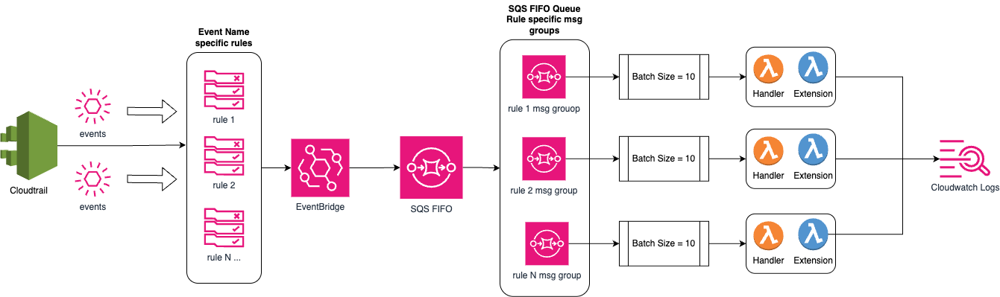

# Rate Limit Monitoring Solution

1. [Overview](#overview)
2. [Configuration](#configuration)
3. [Deployment](#deployment)
4. [Created Resources](#created-resources)
5. [Viewing Metrics](#viewing-metrics)
6. [Testing / Code Coverage](#testing--code-coverage)



## Overview

The Rate Limit Monitoring solution captures control-plane API calls via EventBridge, routes them through a single SQS FIFO queue (with per-event “messageGroupId”s), and processes them in batches of 10 with a Go Lambda. Each batch is emitted as Embedded Metric Format (EMF) logs into CloudWatch Logs to create high-cardinality metrics.

## Configuration

This Lambda uses the following environment variables:

> ** must be set or will cause runtime panic 


| Name             | Description                                                                   | Default |
|------------------|-------------------------------------------------------------------------------|---------|
| **REGIONS          | Comma-separated list of AWS regions to run solution against (e.g.  us-east-1,us-west-2) |  us-east-1  |
| LOG_LEVEL        | Log verbosity (DEBUG, INFO, WARN, ERROR)                                      | INFO |
| **LOG_GROUP_NAME   | CloudWatch Logs group name for EMF output                                     |  /lambda/ratelimit/emf  |
| **METRIC_NAMESPACE | CloudWatch Metric Namespace                                                   |  Rate Limit |

## Deployment

### Prerequisites

- AWS CLI v2  
- AWS SAM CLI (latest)  
- Go v1.22.1 or higher (for local development)

### Build & Deploy

1. Clone the repository 
```bash
git clone https://github.com/aws-samples/sample-resource-quota-and-control-plane-utilization
```

2. Navigate to the Rate Limit infrastructure folder.  Ensure there is a template.yaml file located in that directory. 
```bash 
root-dir/
        infra/
            ratelimit/
                    template.yaml
```


3. From that directory will run the commands below to build and deploy the application. 

```bash
sam build
sam deploy --guided
```

>Tip: Use sam deploy --guided on your first deployment to set a stack name and parameters.

#### What if my stack creation fails? 
If your stack creation fails, due to the nature of cloudformation, you will have to delete the stack before you can deploy it under the same name. 

```bash
# Deleting cloudformation stack 
aws cloudformation delete-stack --stack-name ### YOUR STACK NAME HERE

# Wait for cloudformation to finish delete (optional)
aws cloudformation wait stack-delete-complete --stack-name ### YOUR STACK NAME HERE
```
Once cloudformation has successfully deleted the stack, you may deploy your changes using the sam build and sam deploy referenced earlier.  

## Created Resources 


Out of the box the solution will deploy the following resources on your behalf: 

### Event Bridge
#### AssumeRole Event Rule 
```json 
{
  "detail-type": ["AWS API Call via CloudTrail"],
  "detail": {
    "eventName": ["AssumeRole"]
  }
}
```

- Will send matching events to [AssumeRole Processor Lambda function](#assumeroleprocessor) using event-source mapping
- Batch size = 10

#### AssumeRoleWithWebIdentityRules
```json 
{
  "detail-type": ["AWS API Call via CloudTrail"],
  "detail": {
    "eventName": ["AssumeRoleWithWebIdentity"]
  }
}
```
- Will send matching events to [AssumeRoleWithWebIdentity Lambda function](#assumeroleprocessor) using event-source mapping
- Batch size = 10 

### SQS

- FIFO queue named event-queue.fifo
- Content based deuplication = true
- Visibility timeout = 30 seconds 

#### SQS Queue Policy
```json
{
  "Version": "2012-10-17",
  "Statement": [
    {
      "Sid": "AllowAssumeRole",
      "Effect": "Allow",
      "Principal": {
        "Service": "events.amazonaws.com"
      },
      "Action": [
        "sqs:SendMessage",
        "sqs:SendMessageBatch"
      ],
      "Resource": "arn:aws:sqs:${REGION}:${AWS_ACCOUNT_ID}:events-queue.fifo"
    },
    {
      "Sid": "AllowAssumeRoleWeb",
      "Effect": "Allow",
      "Principal": {
        "Service": "events.amazonaws.com"
      },
      "Action": [
        "sqs:SendMessage",
        "sqs:SendMessageBatch"
      ],
      "Resource": "arn:aws:sqs:${REGION$}:${AWS_ACCOUNT_ID}:events-queue.fifo"
    }
  ]
}
```

### Lambda
#### AssumeRoleProcessor
- Processes the AssumeRole events
#### AssumeRoleWithWebIdentityProcessor
- Processes the AssumeRoleWithWebIdentity events

#### Lambda IAM role (same policy for both)
```yaml
# The IAM role will use the following managed policies 
 - arn:aws:iam::aws:policy/service-role/AWSLambdaBasicExecutionRole
 - arn:aws:iam::aws:policy/service-role/AWSLambdaSQSQueueExecutionRole

 # It will also create this inline policy 
 # Provides access to describe log groups / streams (required during init)
 PolicyName: DescribeLogResources
          PolicyDocument:
            Version: '2012-10-17'
            Statement:
              - Effect: Allow
                Action:
                  - logs:DescribeLogGroups
                  - logs:DescribeLogStreams
                Resource: "*"
```

### Error Metrics
The solution uses a logger interface that will write `ERROR` logs to Cloudwatch Logs whenever there is a downstream I/O error and continue processing.  

Natively in cloudwatch, you can create a "Metric Filter" on the `ERROR` keyword so that whenever cloudwatch gets errors logs, it will add to the error count metric.  This is what you should alarm on to signify there is some issue that needs attention from an administrator.  

#### Creating a Metric Filter (console)

## Viewing Metrics

Work in progress..

## Testing / Code Coverage
### Running Tests
To run the test cases locally before you deploy, you first need to make sure you have Go v1.22.1 or higher installed on your local machine.  If you do not, please refer to the [Prerequisites](#prerequisites) and follow the instructions. 

```bash 
# From the root directory of the project run the following command
# This will produce a coverage report coverage.out file that we will 
# render as html in the next step to view code coverage
go test ./... -covermode=count -coverprofile=coverage.out
```

This will run the test cases for all packages that have *_test.go files.  If you see all "ok" messages on the output, then the tests have passed.  If not, you will see failure messages with the test name. 

```bash 
# next run the following command to generate an html file from the coverage report
go tool cover -html=coverage.out -o coverage.html
```
This will produce a file named `coverage.html` in your root directory.  If you open this file in your browser you will see a code coverage report showing you for each file how much testing coverage it has.  