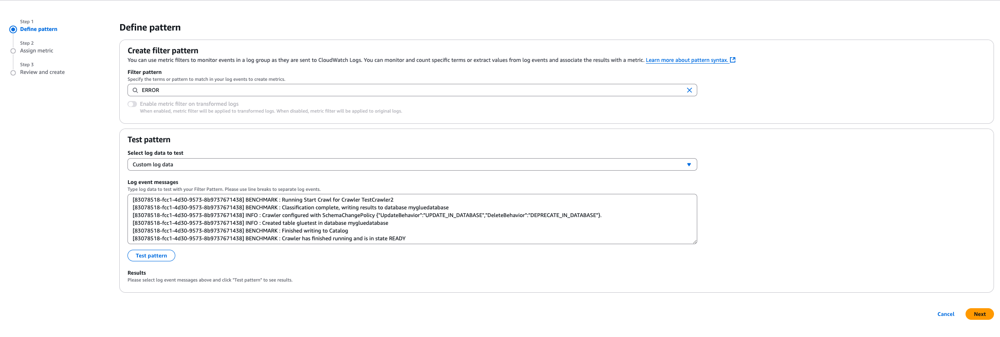

# Rate Limit Monitoring Solution

1. [Overview](#overview)
2. [Configuration](#configuration)
3. [Deployment](#deployment)
4. [Created Resources](#created-resources)
5. [Creating an Alarm](#creating-an-alarm)
6. [Testing / Code Coverage](#testing--code-coverage)


## Overview

The Rate Limit Monitoring solution captures control-plane API calls via EventBridge, routes them through a single SQS FIFO queue (with per-event “messageGroupId”s), and processes them in batches of 10 with a Go Lambda. Each batch is emitted as Embedded Metric Format (EMF) logs into CloudWatch Logs to create custom metrics.

## ⚠️ DISCLAIMER ⚠️
This solution will begin to track events that match the event pattern and populate cloudwatch metrics once deployed.  Please be sure to be aware of any associated costs with deploying and running within your account. 

## Configuration

This Lambda uses the following environment variables:


| Name             | Description                                                                   | Default |
|------------------|-------------------------------------------------------------------------------|---------|
| REGIONS          | Comma-separated list of AWS regions to run solution against (e.g.  us-east-1,us-west-2) |  us-east-1  |
| LOG_LEVEL        | Log verbosity (DEBUG, INFO, WARN, ERROR)                                      | INFO |
| LOG_GROUP_NAME   | CloudWatch Logs group name for EMF output                                     |  /lambda/ratelimit/emf  |
| METRIC_NAMESPACE | CloudWatch Metric Namespace                                                   |  Rate Limit |
| FLUSH_INTERVAL| Interval in seconds that lambda will flush emf records | 45

## Deployment

### Prerequisites

- [AWS CLI v2](https://docs.aws.amazon.com/cli/latest/userguide/getting-started-install.html)  
- [AWS SAM CLI](https://docs.aws.amazon.com/serverless-application-model/latest/developerguide/install-sam-cli.html) (latest)  
- [Go v1.22.1](https://go.dev/doc/install) or higher (for local development) 
### Build & Deploy

The high level steps to fully deployment this solution are : 

- [Cloning the repo ](#clone-the-repository)
- [Building Lambda Extension](#deploying-lambda-extension)
- [Deploy Cloudformation template](#deploying-the-cloudformation-template)

#### Clone the repository 
```bash
git clone https://github.com/aws-samples/sample-resource-quota-and-control-plane-utilization
```

#### Deploying Lambda Extension 

```bash 
cmd/
  emf-extension/      #This folder contains the entry point for the Lambda extension 
              main.go 
```

We have a `Makefile` in the root directory that will handle: 
- building the extension 
- zipping it up properly based on lambda's requirements

Afterward you will need to deploy the zip file to s3 and update the `template.yaml` to use the S3 bucket and object key.  Let walk through step by step 

``` Makefile 
# Makefile

# Name of your extension executable under /opt/extensions
EXT_NAME   := emf

# Where to drop the compiled assets
BUILD_DIR  := build
EXT_DIR    := $(BUILD_DIR)/extensions
BIN_PATH   := $(EXT_DIR)/$(EXT_NAME)

# Path to your extension’s main.go
SRC        := cmd/emf-extension/main.go

.PHONY: all build package clean

all: package

# 1) Build the Linux/ARM64 binary under build/extensions/emf
build:
	mkdir -p $(EXT_DIR)
	GOOS=linux GOARCH=arm64 go build -o $(BIN_PATH) $(SRC)
	chmod +x $(BIN_PATH)

# 2) Zip up the extensions/ tree so it contains:
#    extensions/
#    └── emf   ← your executable
package: build
	cd $(BUILD_DIR) && zip -r ../emf-extension.zip extensions

clean:
	rm -rf $(BUILD_DIR) *.zip

```

This `Makefile` exposes 3 commands: 
- make build 
- make package 
- make clean 

To prepare your lambda extension, first run `make clean` to make sure all older zip files are deleted from the root directory. 

When ready to package it for s3, run `make package`, this will automatically run the build step and then it will package the extension into a zip file that aligns to Lambda's requirements. 

Take the resulting .zip file and put into s3.  Make sure to keep track of the bucket name & object key, you will need it for the next step. 

#### Deploying the Cloudformation Template 

Navigate to the `infra/ratelimit` folder.  Ensure there is a template.yaml file located in that directory. 
```bash 
root-dir/
        infra/
            ratelimit/
                    template.yaml
```

Open the `template.yaml` file and input your s3 bucket name and object where the lambda layer is being created. 

``` yaml 
CloudTrailExtensionLayer: 
    Type: AWS::Lambda::LayerVersion
    Properties:
      LayerName: CloudTrailExtensionLayer
      CompatibleRuntimes:
        - provided.al2023
      Content:
        S3Bucket: ${YOUR_S3_BUCKET_NAME}  # overwrite with your s3 bucket name
        S3Key: ${YOUR_LAYER_OBJECT_KEY}   # overwrite with your object key 
```

3. From that directory, run the commands below to build and deploy the application. 

```bash
sam build
sam deploy --guided
```

>Tip: Use sam deploy --guided on your first deployment 

#### What if my stack creation fails? 
If your stack creation fails, due to the nature of cloudformation, you will have to delete the stack before you can deploy it under the same name. 

```bash
# Deleting cloudformation stack 
aws cloudformation delete-stack --stack-name ### YOUR STACK NAME HERE

# Wait for cloudformation to finish delete (optional)
aws cloudformation wait stack-delete-complete --stack-name ### YOUR STACK NAME HERE
```
Once cloudformation has successfully deleted the stack, you may deploy your changes using the sam build and sam deploy referenced earlier.  

## Created Resources 


Out of the box the solution will deploy the following resources on your behalf: 

### Event Bridge

#### EventBridge Service Role 

```yaml 
EventBridgeDeliveryRole:
    Type: AWS::IAM::Role
    Properties:
      AssumeRolePolicyDocument:
        Version: '2012-10-17'
        Statement:
          - Effect: Allow
            Principal:
              Service: events.amazonaws.com
            Action: sts:AssumeRole
      Policies:
        - PolicyName: AllowSQSSend
          PolicyDocument:
            Version: '2012-10-17'
            Statement:
              - Effect: Allow
                Action:
                  - sqs:SendMessage
                  - sqs:SendMessageBatch
                Resource: !GetAtt EventsQueue.Arn
```
- Purpose :
  - Authorizes eventbridge to deliver events to the targets on the [SQS Queue](#sqs)

#### AssumeRole Event Rule 
```json 
{
  "detail-type": ["AWS API Call via CloudTrail"],
  "detail": {
    "eventName": ["AssumeRole"]
  }
}
```
- Target : [AssumeRole Processor Lambda function](#assumeroleprocessor) 
- Input to target : `$.detail`
- Batch size : `10`
- IAM role : [EventBridge Service Role](#eventbridge-service-role)

#### AssumeRoleWithWebIdentityRules
```json 
{
  "detail-type": ["AWS API Call via CloudTrail"],
  "detail": {
    "eventName": ["AssumeRoleWithWebIdentity"]
  }
}
```
- Target: [AssumeRoleWithWebIdentity Lambda function](#assumeroleprocessor) 
- Input to target : `$.detail`
- Batch size : 10 
- IAM Role : [EventBridge Service Role](#eventbridge-service-role)

### SQS

- Queue name : `event-queue.fifo`
- Type : `FIFO`
- Content based deuplication = `true`
- Visibility timeout = `30 seconds` 
- Encryption : `SSE-SQS`

#### SQS Queue Policy
```json
{
  "Version": "2012-10-17",
  "Statement": [
    {
      "Sid": "AllowAssumeRole",
      "Effect": "Allow",
      "Principal": {
        "Service": "events.amazonaws.com"
      },
      "Action": [
        "sqs:SendMessage",
        "sqs:SendMessageBatch"
      ],
      "Resource": "arn:aws:sqs:${REGION}:${AWS_ACCOUNT_ID}:events-queue.fifo"
    },
    {
      "Sid": "AllowAssumeRoleWeb",
      "Effect": "Allow",
      "Principal": {
        "Service": "events.amazonaws.com"
      },
      "Action": [
        "sqs:SendMessage",
        "sqs:SendMessageBatch"
      ],
      "Resource": "arn:aws:sqs:${REGION$}:${AWS_ACCOUNT_ID}:events-queue.fifo"
    }
  ]
}
```

### Lambda

#### Lambda Function(s)
- Function Name : `AssumeRoleProcessor` 
- Function Name : `AssumeRoleWithWebIdentityProcessor`
- Memory : `128 MB`
- Timeout : `30s`
- IAM Role : [Lambda Execution Role](#lambda-iam-role-same-policy-for-both)
- Purpose : 
  - Ingests cloudtrail events from SQS in batches
  - Converts to EMF
  - Batches EMF's to /tmp by region until batch trigger is reached
  - Batch conditions (per region) : 
    - `10k records`
    - `1 MB total size`
    - `45s (default)`
  - Sends batch of EMFs to cloudtrail logs when triggered

##### Lambda IAM role (same policy for both)
```yaml
# The IAM role will use the following managed policies 
 - arn:aws:iam::aws:policy/service-role/AWSLambdaBasicExecutionRole
 - arn:aws:iam::aws:policy/service-role/AWSLambdaSQSQueueExecutionRole

 # It will also create this inline policy 
 # Provides access to describe log groups / streams (required during init)
 PolicyName: DescribeLogResources
          PolicyDocument:
            Version: '2012-10-17'
            Statement:
              - Effect: Allow
                Action:
                  - logs:DescribeLogGroups
                  - logs:DescribeLogStreams
                Resource: "*"
```

#### Lambda Extension 
- Purpose : 
  - Subsribes to `INVOKE` and `SHUTDOWN` events from Lambda Runtime API
  - On `SHUTDOWN`, it will drain any remaining EMF's that are in /tmp directory
- Uses `[emf]` prefix in logs

### Error Metrics
#### Creating a Metric Filter (console)
The solution uses a logger interface that will write `ERROR` logs to Cloudwatch Logs whenever there is a downstream I/O error and continue processing.  

Natively in cloudwatch, you can create a "Metric Filter" on the `ERROR` keyword so that whenever cloudwatch gets errors logs, it will add to the error count metric.  This is what you should alarm on to signify there is some issue that needs attention from an administrator.  

In order to do this, you first need naviate to the log group that your lambda writes its application logs to and click `Metric Filters` tab then click `create metric filter`.



From there you want to use the `ERROR` filter pattern which will match any error logs the solution produces.  On the next screen you give your metric a name and a namespace and you you will have the ability to create an alarm on this metric to signal that there was some downstream error that occured during processing! 

##### Recommendation

Create your Error metric in a unique namespace specific for the application.  Error Metrics are 1 dimensional so without this, they will collide with other error metrics that may exists in the namespace.  


## Creating an Alarm

After deploying the solution, it will begin to track call counts for the events in scope.  By default it will track the following events : 
- `AssumeRole`
- `AssumeRoleWithWebIdentity`

Navigate to the Cloudwatch Metric tab, you should see your namespace


In order to alarm on the metric you need to create new metric that is normalized over a span of time.  The `CallCount` metric is volume based, it purely tracks call counts.  In order to normalized and alarm, we need to make a metric with the following logic 

```bash 
e1 (new metric) = m1 / 60 #m1 is a reference variable to your call count metric

# This will create a metric that is normalized and produces an RPS level metric
```


Now that we have that metric, you can give it a name such as ${EVENT_NAME}_RPS.  This represents your RPS over a minute time span.  

Now we can alarm on this normalized metric


Now you will be alarmed when ever you RPS exceeds the threshold you define!

## Testing / Code Coverage
### Running Tests
To run the test cases locally before you deploy, you first need to make sure you have Go v1.22.1 or higher installed on your local machine.  If you do not, please refer to the [Prerequisites](#prerequisites) and follow the instructions. 

```bash 
# From the root directory of the project run the following command
# This will produce a coverage report coverage.out file that we will 
# render as html in the next step to view code coverage
go test ./... -covermode=count -coverprofile=coverage.out
```

This will run the test cases for all packages that have *_test.go files.  If you see all "ok" messages on the output, then the tests have passed.  If not, you will see failure messages with the test name. 

```bash 
# next run the following command to generate an html file from the coverage report
go tool cover -html=coverage.out -o coverage.html
```
This will produce a file named `coverage.html` in your root directory.  If you open this file in your browser you will see a code coverage report showing you for each file how much testing coverage it has.  