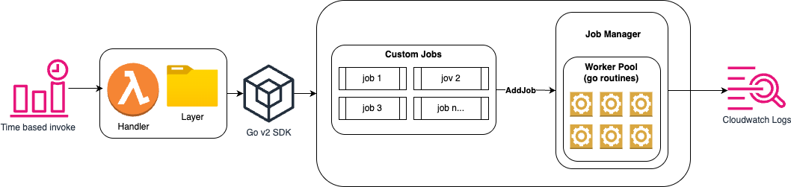
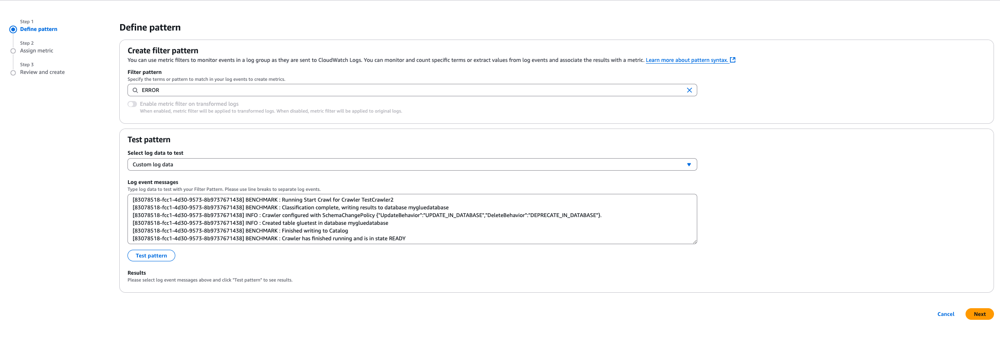
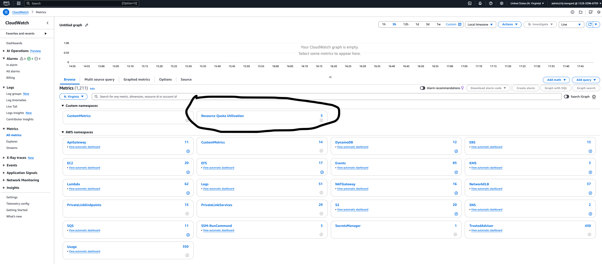
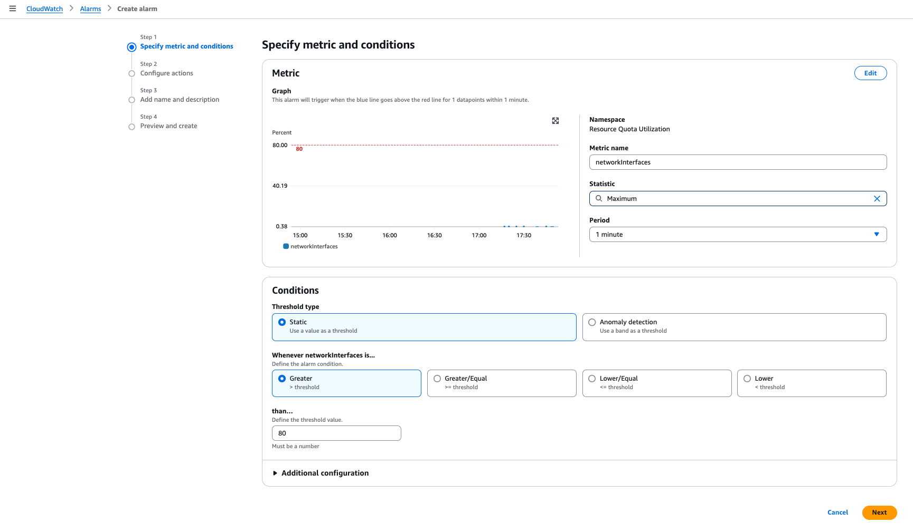

# Resource Quota Monitoring Solution

1. [Overview](#overview)
2. [Configuration](#configuration)
3. [Deployment](#deployment)
4. [Created Resources](#created-resources)
5. [Creating an Alarm](#creating-an-alarm)
6. [Testing / Code Coverage](#testing--code-coverage)



## Overview 

The Resource Quota Solution does the following : 
- captures total counts of various resources specific via your config file
- gets the total allocation from Service Quotas api 
- produces utilization % and send metric to cloudwatch logs via EMF (Embedded Metric Format)

## ⚠️ DISCLAIMER ⚠️
This solution will make various Describe* data plane calls to count resources to produce metrics.  Be aware of any costs associated with deploying and running in your account. 

## Configuration 

This solution requires the following envionment variables

### Environment Variables

| Name             | Description                                                                   | Default |
|------------------|-------------------------------------------------------------------------------|---------|
| LOG_LEVEL        | Log verbosity (DEBUG, INFO, WARN, ERROR)                                      | INFO |
| **LOG_GROUP_NAME   | CloudWatch Logs group name for EMF output                                     |  /lambda/resourcequota/emf  |
| **METRIC_NAMESPACE | CloudWatch Metric Namespace                                                   |  Resource Quota Utilization |
| LAMBDA_LAYER_PATH | path to the location of the config.json file in the lambda layer.  If you made any changes to the lambda layer. You need to make sure to update this variable accordingly. | /opt/config/config.json |

### Config File

Here is an example of the config file shape that we require.  It is a map of service names such as `ec2, eks, iam, vpc` etc.  Each will have an array of `quotaMetrics`.  This is how we know which metrics you want to capture.  

```json 
{
  "services": {
    "ec2": {
      "quotaMetrics": [
        {
          "name": "networkInterfaces"
        }
      ]
    },
    "ebs" : { 
      "quotaMetrics" : [
        {
          "name": "gp3storage"
        }
      ]
    },
    "iam": {
      "quotaMetrics": [
        {
          "name": "oidcProviders"          
        },
        {
          "name": "iamRoles"
        }
      ]
    },
    "vpc" :{ 
      "quotaMetrics" : [
        { 
          "name": "nau"
        }
      ]
    },
    "eks" : { 
      "quotaMetrics" : [
        {
          "name": "listClusters"
        }
      ]
    },
    "sts": {
      "rateLimitAPIs": [
        {
          "name": "assumeRole"
        },
        {
          "name": "assumeRoleWithWebIdentity"
        }
      ]
    }
  },
  "regions": [
    "us-east-1",
    "us-west-2"
  ]
}
```

### Valid Metrics per serice 

We will add mmore metrics based on customer feedback but below is what we have converage for today. 

``` bash 
- ec2 
  - networkInterfaces
- eks 
  - listClusters
- vpc 
  - nau
- iam 
  - iamRoles
  - oidcProviders
- ebs
  - gp3Storage
```

#### ⚠️ Attention⚠️
For the `iamRoles` and `gp3Storage` metric, we use the Support API to perform `RefreshTrustedAdvisorCheck` against the Trusted Advisor service.  You need at least business support for this metric to work, if not, the solution will throw a 404 exception but it will continue to calculate other metrics.

## Deployment 

### Prerequisites

- [AWS CLI v2](https://docs.aws.amazon.com/cli/latest/userguide/getting-started-install.html)  
- [AWS SAM CLI](https://docs.aws.amazon.com/serverless-application-model/latest/developerguide/install-sam-cli.html) (latest)  
- [Go v1.22.1](https://go.dev/doc/install) or higher (for local development)

### Build & Deploy

The high level steps to fully deploy this solution are: 
- [Cloning the repo](#clone-the-repository)
- [Building the Lambda Layer](#building-the-lamdba-layer)
- [Deploying the Cloudformation Tempate](#deploying-the-cloudformation-template)

### Clone the repository 
```bash
git clone https://github.com/aws-samples/sample-resource-quota-and-control-plane-utilization
```

### Building the Lamdba Layer

We need to make sure the lambda layer is uploaded to S3 prior to deployment, so that when we deploy the cloudformation template, it will pull the layer.zip from s3. 

If you plan to use the sample layer we have provided. Navigate to the directory
```bash 
cd lambda-layer
zip -r lambda-layer.zip . # This will produce a lambda-layer.zip file which contians the lambda layer 

# Our sample layer has the directory structure 
config/ 
    config.json # This is the file lambda will read to initialize 
```
Our sample config.json will look like what is shown below.  The structure of the config file is a map of service names (`ec2, ebs, iam` etc).  Each map will contain an array of `quotaMetrics`.  This tells the solution will metrics it needs to capture.  These map to the metric we currently have coverage for.  As more metrics are added to the solution, we will update the config file accordingly. 

```json 
{
  "services": {
    "ec2": {
      "quotaMetrics": [
        {
          "name": "networkInterfaces"
        }
      ]
    },
    "ebs" : { 
      "quotaMetrics" : [
        {
          "name": "gp3storage"
        }
      ]
    },
    "iam": {
      "quotaMetrics": [
        {
          "name": "oidcProviders"          
        },
        {
          "name": "iamRoles"
        }
      ]
    },
    "vpc" :{ 
      "quotaMetrics" : [
        { 
          "name": "nau"
        }
      ]
    },
    "eks" : { 
      "quotaMetrics" : [
        {
          "name": "listClusters"
        }
      ]
    },
    "sts": {
      "rateLimitAPIs": [
        {
          "name": "assumeRole"
        },
        {
          "name": "assumeRoleWithWebIdentity"
        }
      ]
    }
  },
  "regions": [
    "us-east-1",
    "us-west-2"
  ]
}
```

Finally you need to upload the resulting lambda-layer.zip file to an s3 bucket and keep track of the full path as we will need to add it to the cloudformation template. 

#### Deploying the Cloudformation Template

Navigate to the `infra/resourcequota` folder.  Ensure there is a template.yaml file located in that directory. 
```bash 
root-dir/
        infra/
            ratelimit/
                    template.yaml
```

In the template.yaml you need to ensure you input your s3 bucket and key for the lambda layer : 

```yaml 
# Lambda Layer that stores the configuration for the solution
  ConfigFileLambdaLayer:
    Type: AWS::Lambda::LayerVersion
    Properties:
      LayerName: resource-quota-config
      Description: Configuration for resource quota utilization solution 
      Content:
        S3Bucket: custom-monitoring-poc ## Overwrite with your s3 bucket name 
        S3Key: layers/layer.zip # Overwrite with your object key
      CompatibleArchitectures:
        - arm64
      CompatibleRuntimes:
        - provided.al2023

```
Save your changes 

3. From the `infra/resourcequota` directory, run the commands below to build and deploy the application. 

```bash
sam build
sam deploy --guided
```

>Tip: Use sam deploy --guided on your first deployment 

#### What if my stack creation fails? 
If your stack creation fails, due to the nature of cloudformation, you will have to delete the stack before you can deploy it under the same name. 

```bash
# Deleting cloudformation stack 
aws cloudformation delete-stack --stack-name ### YOUR STACK NAME HERE

# Wait for cloudformation to finish delete (optional)
aws cloudformation wait stack-delete-complete --stack-name ### YOUR STACK NAME HERE
```
Once cloudformation has successfully deleted the stack, you may deploy your changes using the sam build and sam deploy commands referenced earlier.

## Created Resources

### Lambda 
- Function Name : `geras-resource-quota`
- Memory : `128 MB`

### EventBridge Trigger 
- Schedule:  `5 minutes` (default)

### Error Metrics
#### Creating a Metric Filter (console)
The solution uses a logger interface that will write `ERROR` logs to Cloudwatch Logs whenever there is a downstream I/O error and continue processing.  

Natively in cloudwatch, you can create a "Metric Filter" on the `ERROR` keyword so that whenever cloudwatch gets errors logs, it will add to the error count metric.  This is what you should alarm on to signify there is some issue that needs attention from an administrator.  

In order to do this, you first need naviate to the log group that your lambda writes its application logs to and click `Metric Filters` tab then click `create metric filter`.



From there you want to use the `ERROR` filter pattern which will match any error logs the solution produces.  On the next screen you give your metric a name and a namespace and you you will have the ability to create an alarm on this metric to signal that there was some downstream error that occured during processing! 

## Creating an Alarm
After deploying the solution and it running you should see your custom namespace when you click the `Metric` tab in cloudwatch. 



From here you can set alarms on your metrics to alert you when it reaches a threshold you define. Below is an example using my networkInterfaces metric. 



From here you can define the threshold that meets your requirement.  Be sure to use the `Maximum` statisic.  This will ensure cloudwatch will use the maximum value over the given time period to alarm on. 

## Testing / Code Coverage 
### Running Tests
To run the test cases locally before you deploy, you first need to make sure you have Go v1.22.1 or higher installed on your local machine.  If you do not, please refer to the [Prerequisites](#prerequisites) and follow the instructions. 

```bash 
# From the root directory of the project run the following command
# This will produce a coverage report coverage.out file that we will 
# render as html in the next step to view code coverage
go test ./... -covermode=count -coverprofile=coverage.out
```

This will run the test cases for all packages that have *_test.go files.  If you see all "ok" messages on the output, then the tests have passed.  If not, you will see failure messages with the test name. 

```bash 
# next run the following command to generate an html file from the coverage report
go tool cover -html=coverage.out -o coverage.html
```
This will produce a file named `coverage.html` in your root directory.  If you open this file in your browser you will see a code coverage report showing you for each file how much testing coverage it has.  