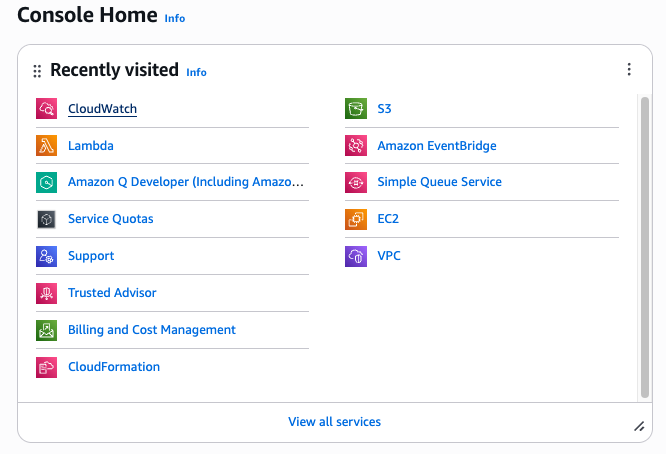
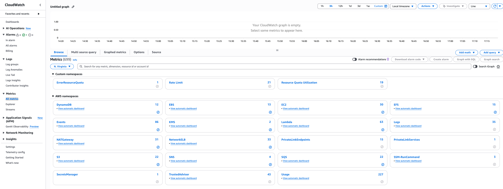
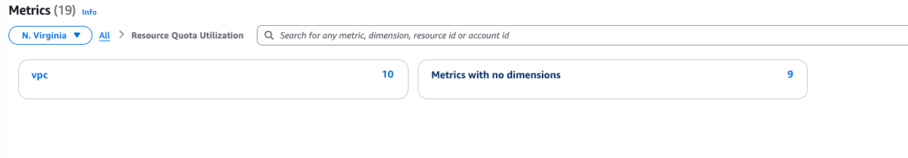
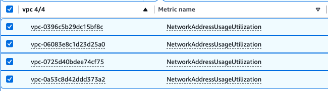
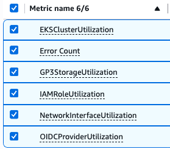

# Resource Quota Monitoring Solution

1. [Overview](#overview)
2. [Prerequisites](#prerequisites)
3. [Metrics Overview](#metrics-overview)
4. [Configuration File](#configuration-file)
5. [Deployment Guide](#deployment-guide)
    - [AWS SAM / Cloudformation](#deploying-with-aws-sam--cloudformation)
    - [Terraform](#deploying-with-terraform)
6. [Tips: Automating Deployment](#tip-automating-builds--deployment)
7. [Testing & Code Coverage](#testing--code-coverage)
8. [Viewing the Metrics](#viewing-the-metrics)


## Overview 

The Resource Quota Monitoring Solution tracks AWS resource utilization against service quotas, publishing metrics to CloudWatch to help prevent resource exhaustion and quota limits.

.png)

## Prerequisites

- [AWS CLI v2](https://docs.aws.amazon.com/cli/latest/userguide/getting-started-install.html)  
- [AWS SAM CLI](https://docs.aws.amazon.com/serverless-application-model/latest/developerguide/install-sam-cli.html) (latest)  
- [Go v1.22.1](https://go.dev/doc/install) or higher (for local development)

**Tools**

| Tool         | Version      | Install                                                                                          |
|--------------|--------------|--------------------------------------------------------------------------------------------------|
| Go           | ≥1.23.0      | https://golang.org/dl/                                                                           |
| Terraform    | ≥1.0.0       | https://learn.hashicorp.com/tutorials/terraform/install-cli                                      |
| AWS SAM CLI  | ≥1.142.1     | https://docs.aws.amazon.com/serverless-application-model/latest/developerguide/install-sam-cli.html |
| AWS CLI      | Latest       | https://docs.aws.amazon.com/cli/latest/userguide/getting-started-install.html                    |


## Metrics Overview

The Resource Quota Solution:

Captures total counts of various resources specified via your config file

Gets the total allocation from Service Quotas API

Produces utilization percentages and sends metrics to CloudWatch Logs via EMF (Embedded Metric Format)

### Available Metrics

| Service | Metric Name                  | Description                                        | Recommended Alarm Threshold |
|---------|------------------------------|----------------------------------------------------|------------------------|
| EC2     | NetworkInterfacesUtilization | Percentage of ENIs used against quota              | 80%                   |
| EKS     | EKSClusterUtilization        | Percentage of EKS clusters used against quota      | 80%                   |
| VPC     | NetworkAddressUsageUtilization | Percentage of NAUs used per VPC                 | 70%                   |
| IAM     | IAMRolesUtilization          | Percentage of IAM roles used against quota         | 80%                   |
| IAM     | OIDCProviderUtilization      | Percentage of OIDC providers used against quota    | 80%                   |
| EBS     | GP3StorageUtilization        | Percentage of GP3 storage used against quota       | 80%                   |

## Configuration File

The solution uses a `config.json` file deployed as a Lambda layer to control which metrics are collected.

**Example Configuration**
``` json
{
  "services": {
    "ec2": {
      "quotaMetrics": [
        {
          "name": "networkInterfaces"
        }
      ]
    },
    "ebs" : { 
      "quotaMetrics" : [
        {
          "name": "gp3Storage"
        }
      ]
    },
    "iam": {
      "quotaMetrics": [
        {
          "name": "oidcProviders"          
        },
        {
          "name": "iamRoles"
        }
      ]
    },
    "vpc" :{ 
      "quotaMetrics" : [
        { 
          "name": "nau"
        }
      ]
    },
    "eks" : { 
      "quotaMetrics" : [
        {
          "name": "listClusters"
        }
      ]
    }
  }
}
```

## Deployment Guide

#### ⚠️ Disclaimer ⚠️
This repository is provided as a functional example to demonstrate how you might calculate resource quota utilization, and emit EMF metrics via Lambda. It is not intended to represent a production-ready "drop in" solution. Before using in any live environment, you should:

- Review and adjust IAM permissions to follow the principle of least privilege
- Review encryption at rest and in transit for all resources (SQS, Lambda, logs, etc.)
- Configure VPC, subnet, and security group settings according to your network requirements
- Implement proper monitoring, alerting, and log retention lifecycles
- Be aware of any costs associated with deploying in your account(s)

Use this sample as a starting point, not a drop-in solution. Customize this solution based on your organization’s security, reliability, and operational requirements.

### Environment Variables

| Name             | Description                                                                   | Default |
|------------------|-------------------------------------------------------------------------------|---------|
| LOG_LEVEL        | Log verbosity (DEBUG, INFO, WARN, ERROR)                                      | INFO |
| LOG_GROUP_NAME   | CloudWatch Logs group name for EMF output                                     |  /lambda/resourcequota/emf  |
| METRIC_NAMESPACE | CloudWatch Metric Namespace                                                   |  Resource Quota Utilization |
| LAMBDA_LAYER_PATH | Path to the location of the config.json file in the Lambda layer. If you made any changes to the Lambda layer, you need to update this variable accordingly. | /opt/config/config.json |


---

### Deploying with AWS SAM / Cloudformation

Prior to deploying, please review the resource below to see what AWS SAM / Cloudformation will deploy. 

#### ⚠️ Warning ⚠️
Please make changes to the template based on your specific environment / security requirements.  This is a functional sample but is not intended to be production ready by default

#### Resources

| Logical ID                   | Type                            | Description                                                           | Key Properties                                                                                                                                                                                                                   |
|------------------------------|---------------------------------|-----------------------------------------------------------------------|----------------------------------------------------------------------------------------------------------------------------------------------------------------------------------------------------------------------------------|
| **LambdaExecutionRole**      | `AWS::IAM::Role`                | IAM role assumed by the ResourceQuota Lambda, with permissions to describe quotas and write to CloudWatch & S3. | - **AssumeRolePolicyDocument:** Allows `lambda.amazonaws.com` to assume<br>- **ManagedPolicyArns:** `AWSLambdaBasicExecutionRole`<br>- **Inline Policy (ResourceQuotaPolicy):**<br>  • **EC2:** `ec2:DescribeNetworkInterfaces`, `ec2:DescribeVolumes`, `ec2:DescribeVpcs`<br>  • **EKS:** `eks:ListClusters`<br>  • **IAM:** `iam:ListOpenIDConnectProviders`, `iam:ListRoles`<br>  • **CloudWatch Logs:** `logs:DescribeLogGroups`, `logs:CreateLogGroup`, `logs:DescribeLogStreams`, `logs:CreateLogStream`, `logs:PutLogEvents`<br>  • **Service Quotas:** `servicequotas:GetServiceQuota`<br>  • **S3:** `s3:PutObject`, `s3:PutObjectAcl` on `arn:aws:s3:::${S3BucketName}/*`; `s3:ListBucket` on `arn:aws:s3:::${S3BucketName}` |
| **ConfigFileLambdaLayer**    | `AWS::Serverless::LayerVersion` | Lambda layer containing the JSON config used by the resource-quota monitor. | - **LayerName:** `resource-quota-config`<br>- **ContentUri:** `../../../lambda-layer/`<br>- **CompatibleArchitectures:** `arm64`<br>- **CompatibleRuntimes:** `provided.al2023`                                          |
| **ResourceQuotaFunction**    | `AWS::Serverless::Function`     | Go-based Lambda that runs every 5 minutes to poll quotas and emit EMF metrics. | - **FunctionName:** `geras-resource-quota`<br>- **Runtime:** `provided.al2023`<br>- **CodeUri/Handler:** Go binary (`bootstrap`)<br>- **Role:** `!GetAtt LambdaExecutionRole.Arn`<br>- **Layers:** `ConfigFileLambdaLayer`<br>- **Environment Variables:** `LAMBDA_LAYER_PATH`, `CLOUDWATCH_LOG_GROUP`, `METRIC_NAMESPACE`, `LOG_LEVEL`, `S3_BUCKET`, `HOME_REGION`, `REGIONS`<br>- **Events:** `Schedule` (`rate(5 minutes)`), enabled |
| **ResourceQuotaErrorFilter** | `AWS::Logs::MetricFilter`       | Captures any `"ERROR"` log lines from the Lambda and turns them into CloudWatch metrics. | - **FilterPattern:** `"ERROR"`<br>- **LogGroupName:** `/aws/lambda/${ResourceQuotaFunction}`<br>- **MetricTransformations:** `MetricName: "Error Count"`, `MetricNamespace: !Ref MetricNamespace`, `MetricValue: "1"`    |
| **ResourceQuotaErrorAlarm**  | `AWS::CloudWatch::Alarm`        | Alarm triggered when the MetricFilter records ≥ 1 error in a 1-minute period. | - **AlarmName:** `ResourceQuota-Error-Alarm`<br>- **AlarmDescription:** “Alarm when the ResourceQuotaLambda emits any error logs”<br>- **Namespace/MetricName:** `!Ref MetricNamespace` / `"Error Count"`<br>- **Dimensions:** `LogGroupName = /aws/lambda/${ResourceQuotaFunction}`<br>- **Statistic:** `Sum`<br>- **Period:** `60`<br>- **EvaluationPeriods:** `1`<br>- **Threshold:** `1`<br>- **ComparisonOperator:** `GreaterThanOrEqualToThreshold`<br>- **TreatMissingData:** `notBreaching` |

---

#### Parameters

| Parameter Name         | Type   | Description                                                             | Default                           | Valid Choices                   |
|--------------------|--------|-------------------------------------------------------------------------|-----------------------------------|---------------------------------|
| CloudWatchLogGroup | String | CloudWatch Log Group where EMF metrics are published                    | `/lambda/resource-quota/emf`      | —                               |
| MetricNamespace    | String | CloudWatch Metric Namespace for quota-utilization metrics               | `Resource Quota Utilization`      | —                               |
| LogLevel           | String | Log verbosity for the Lambda function                                   | `info`                            | `debug`, `info`, `warn`, `error`|
| LambdaLayerPath    | String | File path inside the layer where your `config.json` lives                | `/opt/config/config.json`         | —                               |
| S3BucketName       | String | S3 bucket for storing the resource-quota manifest file                  | `resource-quota-utilization-2025` | —                               |
| HomeRegion         | String | “Home” AWS region used by the ResourceQuota job (e.g. for cross-region) | `us-east-1`                       | —                               |
| Regions            | String | Comma-separated list of AWS regions to generate metrics for             | `us-east-1`                       | —                               |

---

#### Steps 

1. **Clone the repository**
```bash
git clone https://github.com/aws-samples/sample-resource-quota-and-control-plane-utilization
```
2. **Build & deploy with AWS SAM / Cloudformation**

Navigate to the `infra/cloudformation/resourcequota` folder. Ensure there is a template.yaml file located in that directory. 
```bash 
root-dir/
        infra/
            cloudformation/
                    resourcequota/
                          template.yaml
```

From the `infra/cloudformation/resourcequota` directory, run the commands below to build and deploy the application. 

```bash
sam build
sam deploy --guided
```

> **Tip:** Use `sam deploy --guided` on your first deployment 

---

### Deploying With Terraform

Prior to deploying, please review the resource below to see what Terraform will deploy.  

#### ⚠️ Warning ⚠️
Please make changes to the template based on your specific environment and security requirements. This is a functional sample but is not verified to be production-ready by default.

#### Resources 

| Logical ID                                   | Type                                     | Description                                                                     | Key Properties                                                                                                                                                                                                                                              |
|----------------------------------------------|------------------------------------------|---------------------------------------------------------------------------------|-------------------------------------------------------------------------------------------------------------------------------------------------------------------------------------------------------------------------------------------------------------|
| `data.aws_iam_policy.basic_exec`             | `data "aws_iam_policy"`                  | Lookup AWS-managed policy for basic Lambda execution.                            | • **arn**: `"arn:aws:iam::aws:policy/service-role/AWSLambdaBasicExecutionRole"`                                                                                                                                        |
| `aws_iam_role.lambda_exec`                   | `resource "aws_iam_role"`                | IAM role assumed by the Lambda function.                                         | • **name**: `"resource_quota_lambda_exec"`<br>• **assume_role_policy**: JSON securing `sts:AssumeRole` for `lambda.amazonaws.com`                                                                                                                    |
| `aws_iam_role_policy_attachment.attach_basic`| `resource "aws_iam_role_policy_attachment"` | Attaches the basic execution managed policy to the Lambda role.                  | • **role**: `aws_iam_role.lambda_exec.name`<br>• **policy_arn**: `data.aws_iam_policy.basic_exec.arn`                                                                                                          |
| `aws_iam_role_policy.resource_quota`         | `resource "aws_iam_role_policy"`         | Inline policy granting quota-monitoring and S3 permissions.                      | • **name**: `"ResourceQuotaPolicy"`<br>• **role**: `aws_iam_role.lambda_exec.id`<br>• **policy**: JSON with statements for EC2 Describe*, EKS ListClusters, IAM List*, CloudWatch Logs, ServiceQuotas:GetServiceQuota, S3 Put*/ListBucket |
| `data.archive_file.lambda_config_layer`      | `data "archive_file"`                    | Creates a ZIP of the config directory for the Lambda layer.                      | • **type**: `"zip"`<br>• **source_dir**: `"${path.module}/../../../lambda-layer"`<br>• **output_path**: `"${path.module}/lambda-layer.zip"`                                                                                                   |
| `aws_lambda_layer_version.config`            | `resource "aws_lambda_layer_version"`    | Lambda layer containing resource-quota configuration.                            | • **layer_name**: `"resource-quota-config"`<br>• **description**: `"Configuration for resource quota utilization"`<br>• **compatible_runtimes**: `["provided.al2023"]`<br>• **compatible_architectures**:`["arm64"]`<br>• **filename**: `data.archive_file.lambda_config_layer.output_path` |
| `aws_lambda_function.resource_quota`         | `resource "aws_lambda_function"`         | Go-based Lambda that polls quotas every 5 minutes and emits EMF metrics.         | • **function_name**: `"geras-resource-quota"`<br>• **filename**: `local.resourcequota_zip`<br>• **role**: `aws_iam_role.lambda_exec.arn`<br>• **handler/runtime/architectures/timeout**: `"bootstrap"`, `"provided.al2"`, `["arm64"]`, `900s`<br>• **layers**: `aws_lambda_layer_version.config.arn`<br>• **environment**: vars for layer path, log group, namespace, log level, S3 bucket, home region, regions |
| `aws_cloudwatch_event_rule.every_5m`         | `resource "aws_cloudwatch_event_rule"`   | EventBridge rule to trigger the Lambda every five minutes.                      | • **name**: `"ResourceQuotaEveryFiveMinutes"`<br>• **schedule_expression**: `"rate(5 minutes)"`                                                                                                                               |
| `aws_cloudwatch_event_target.every_5m_target`| `resource "aws_cloudwatch_event_target"` | Associates the schedule rule with the Lambda function.                           | • **rule**: `aws_cloudwatch_event_rule.every_5m.name`<br>• **arn**: `aws_lambda_function.resource_quota.arn`                                                                                                                   |
| `aws_lambda_permission.allow_event`          | `resource "aws_lambda_permission"`       | Grants EventBridge permission to invoke the Lambda.                              | • **statement_id**: `"AllowExecutionFromEvents"`<br>• **action**: `"lambda:InvokeFunction"`<br>• **function_name**: `aws_lambda_function.resource_quota.function_name`<br>• **principal**: `"events.amazonaws.com"`<br>• **source_arn**: `aws_cloudwatch_event_rule.every_5m.arn` |
| `aws_cloudwatch_log_metric_filter.resource_quota_error` | `resource "aws_cloudwatch_log_metric_filter"` | Creates a CloudWatch metric from ERROR logs in the Lambda log group.            | • **name**: `"ResourceQuota-ErrorFilter"`<br>• **log_group_name**: `"/aws/lambda/${aws_lambda_function.resource_quota.function_name}"`<br>• **pattern**: `"\"ERROR\""`<br>• **metric_transformation**: `name="ErrorCount"`, `namespace=var.metric_namespace`, `value="1"` |
| `aws_cloudwatch_metric_alarm.resource_quota_error_alarm`| `resource "aws_cloudwatch_metric_alarm"`| Alarm if the Lambda emits any ERROR logs within 1 minute.                       | • **alarm_name**: `"ResourceQuota-Error-Alarm"`<br>• **alarm_description**: `"Fires if the ResourceQuota Lambda emits any ERROR logs"`<br>• **namespace/metric_name**: `var.metric_namespace` / `"ErrorCount"`<br>• **statistic/period/evaluation_periods/threshold/comparison_operator/treat_missing_data**: `"Sum"`, `60`, `1`, `1`, `"GreaterThanOrEqualToThreshold"`, `"notBreaching"`<br>• **dimensions**: `LogGroupName="/aws/lambda/${aws_lambda_function.resource_quota.function_name}"` |
| `output.resource_quota_function_arn`         | `output`                                 | Exposes the ARN of the ResourceQuota Lambda function.                            | • **description**: `"ARN of the ResourceQuota Lambda"`<br>• **value**: `aws_lambda_function.resource_quota.arn`                                                                                                                  |

 ---

#### Variables 

| Name                  | Type           | Description                                            | Default                            |
|-----------------------|----------------|--------------------------------------------------------|------------------------------------|
| `cloudwatch_log_group`| string         | CloudWatch Log Group for EMF output                    | `/lambda/resource-quota/emf`       |
| `metric_namespace`    | string         | Metric Namespace for resource quota utilization        | `Resource Quota Utilization`       |
| `log_level`           | string         | Log level for the Lambda function                      | `debug`                            |
| `lambda_layer_path`   | string         | Path inside Lambda Layer where config lives            | `/opt/config/config.json`          |
| `s3_bucket_name`      | string         | S3 bucket to hold the resource-quota manifest          | `resource-quota-utilization-2025`  |
| `home_region`         | string         | Home AWS region for the manifest file                  | `us-east-1`                        |
| `regions`             | list(string)   | List of regions you want to generate metrics for       | `["us-east-1"]`                    |

#### Steps

1. **Clone the repo**  
   ```bash
   git clone https://github.com/aws-samples/sample-resource-quota-and-control-plane-utilization
   cd sample-resource-quota-and-control-plane-utilization
   ```

2. **Build the Resource Quota Lambda Function**

We provide a dedicated Makefile (`Makefile.resourcequota`) to compile & package the ResourceQuota function.  Terraform is configured to use this directory to pull the artifact and deploy to AWS:

> NOTE: If you wish to push the artifact to S3 or another location instead, please ensure you edit the infra/terraform/main.tf file accordinly to reflect these changes


```bash 
# Compile and package the ResourceQuota lambda binary into dist/resourcequota/resourcequota.zip
make -f Makefile.resourcequota all

# Remove build artifacts for ResourceQuota only
make -f Makefile.resourcequota clean


dist/
└── resourcequota/
    ├── bootstrap             ← ARM64 Linux binary
    └── resourcequota.zip     ← zip containing only the executable
```

3. **Initialize and apply Terraform plan**
```bash
# Initialize Terraform
terraform init

# Create an execution plan and save it to tfplan
terraform plan -out=tfplan \
  -var="cloudwatch_log_group=/lambda/resource-quota/emf" \
  -var="metric_namespace=Resource Quota Utilization" \
  -var="log_level=info" \
  -var="lambda_layer_path=/opt/config/config.json" \
  -var="s3_bucket_name=my-quota-manifest-bucket" \
  -var="home_region=us-east-1" \
  -var='regions=["us-east-1","us-west-2"]'

# Review the plan:
terraform show tfplan

# Apply the saved plan
terraform apply -auto-approve tfplan
```

---

## Tip: Automating Builds & Deployment

You can integrate these `make` and deployment steps into a CI/CD pipeline (GitHub Actions, GitLab CI, Jenkins, etc.) or run them inside a dedicated build container as a **pre-deployment hook**. This ensures:

- **Reproducible artifacts** in a clean environment  
- **Early failure detection** in pull requests  
- **Consistent deployments** across all agents  
- **Decoupling** developers from local workstation dependencies  

Simply invoke your `make` targets and SAM/Terraform commands in your pipeline’s build stage prior to the deploy stage.

## Testing & Code Coverage

We use `Makefile.tests` to streamline unit testing and coverage reporting.

### Available Targets
Run all commands with the `-f Makefile.tests` flag:

- **`make -f Makefile.tests test-coverage`**  
  Run tests in `internal/...` and generate a coverage profile at `coverage/coverage.out`.  
- **`make -f Makefile.tests coverage-html`**  
  Convert the profile into an HTML report at `coverage/coverage.html`.  
- **`make -f Makefile.tests coverage-open`**  
  Open the HTML report in your default browser (`open` on macOS, `xdg-open` on Linux).  
- **`make -f Makefile.tests coverage-all`**  
  Run tests, generate HTML report, and open it in one step.  
- **`make -f Makefile.tests coverage-clean`**  
  Remove the `coverage/` directory and its contents.  

### Best Practices
- **Local checks:** Run `make -f Makefile.tests test-coverage` before opening PRs to ensure no regressions.  
- **CI integration:** Add `make -f Makefile.tests coverage-html` to your pipeline to publish coverage artifacts.  
- **Coverage goals:** Strive for high coverage in `internal/...` packages; add tests for new code paths.  

---

## Viewing the Metrics 

To view the metrics published by the solution please follow the steps below.  

1.   **Navigate to Cloudwatch**

From the homepage of the your AWS console click CloudWatch. 



2.  **Navigate to Metric Tab**

Next, click the `All Metrics` tabs on the left side of the screen.  You should know see namespaces.  On the top should be custom namespaces where you'll see `Resource Quota Utilization` (if you kept our default namespace name.  If not, navigate to the custom namespace that you created.)



3. **Viewing the metrics**


You should now see namespaces:

- `vpc` 
  - contain `NetworkAddressUsageUtilization` metric

  


- `Metrics with no dimensions`
  - contains all other metrics

